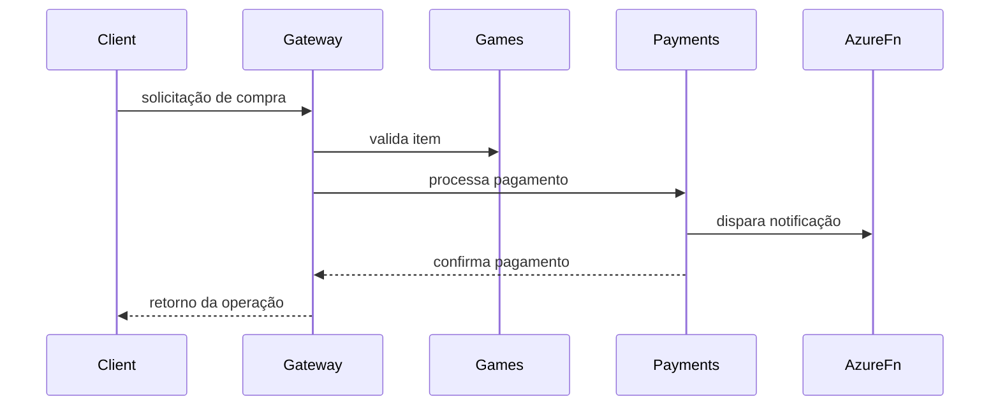

# 💸 FIAP Cloud Payments — Payments Service

Microsserviço de pagamentos do ecossistema FIAP Cloud Games (FCG).  
Responsável pelo processamento e consulta de status de transações financeiras realizadas na plataforma.

---

## 🎯 Objetivos

- Processar pagamentos de compras realizadas na plataforma.  
- Expor endpoints para criação e verificação de status de transações.  
- Integrar com notificações assíncronas via Azure Functions (ex: envio de e-mail).  
- Servir como backend consultável por outros microsserviços (Games, Users, etc).  

---

## 🧱 Arquitetura & Organização

Estrutura atual baseada em organização modular:

```
src/
├── Controllers/ → Endpoints e APIs REST
├── Domain/ → Eventos e entidades relacionadas a pagamentos
├── Services/ → Lógica de negócio (ex: processamento de pagamentos)
├── appsettings.json → Configurações
├── Program.cs → Entry point
```

Tecnologias utilizadas:

- .NET 8 / C#  
- ASP.NET Core Web API  
- Azure Functions (para notificações)  
- Docker (opcional, para empacotamento da API)  
- Swagger / OpenAPI  

---

## 🔄 Comunicação com outros Microsserviços

Exemplo de fluxo de comunicação:



---

## ⚙️ Configuração do Ambiente

### Requisitos

- .NET SDK 8.0+  
- Azure CLI (caso use Azure Functions)  
- Ferramenta REST (Postman, Insomnia)  
- (Opcional) Docker

### Variáveis de Ambiente (exemplos)

| Variável                     | Descrição                             | Exemplo                          |
|-----------------------------|-----------------------------------------|----------------------------------|
| PAYMENT_DB_CONN             | String de conexão com banco (futuro)  | Server=.;Database=Payments;...   |
| ASPNETCORE_ENVIRONMENT      | Ambiente de execução                  | Development                      |
| LOG_LEVEL                   | Nível de log                          | Information, Warning             |

---

## ▶️ Executar Localmente

1. Certifique-se de ter o .NET instalado.  
2. Navegue até a pasta do projeto `fiap-cloud-payments/`  
3. Execute os comandos:

```bash
dotnet build
dotnet run
```

4. A API deve rodar em `http://localhost:5000` (ou porta definida).  
5. Acesse `http://localhost:5000/swagger` para explorar os endpoints.

---

## 🧪 Endpoints Principais

| Método | Rota                  | Descrição                       |
|--------|-----------------------|----------------------------------|
| POST   | `/api/pagamentos`     | Realizar novo pagamento          |
| GET    | `/api/pagamentos/{id}`| Consultar status de pagamento    |

> As rotas podem variar conforme o desenvolvimento avança. Consulte a documentação Swagger gerada.

---

## ☁️ Integração com Azure Functions

O projeto prevê integração com Azure Functions para disparar notificações (e-mail, logs, etc) de forma assíncrona, simulando eventos após a conclusão do pagamento.


---

## 📂 Estrutura Adicional

```
Controllers/ → Contém o PagamentosController
Domain/Events → Eventos do domínio
Services/ → Serviços e lógica de pagamento
```

---

## 📌 Notas Finais

- Este projeto é parte do ecossistema FIAP Cloud Games.
- Focado em responsabilidade única (SRP): somente pagamento.
- Pode ser expandido para suportar múltiplos métodos de pagamento, logs, antifraude, etc.
